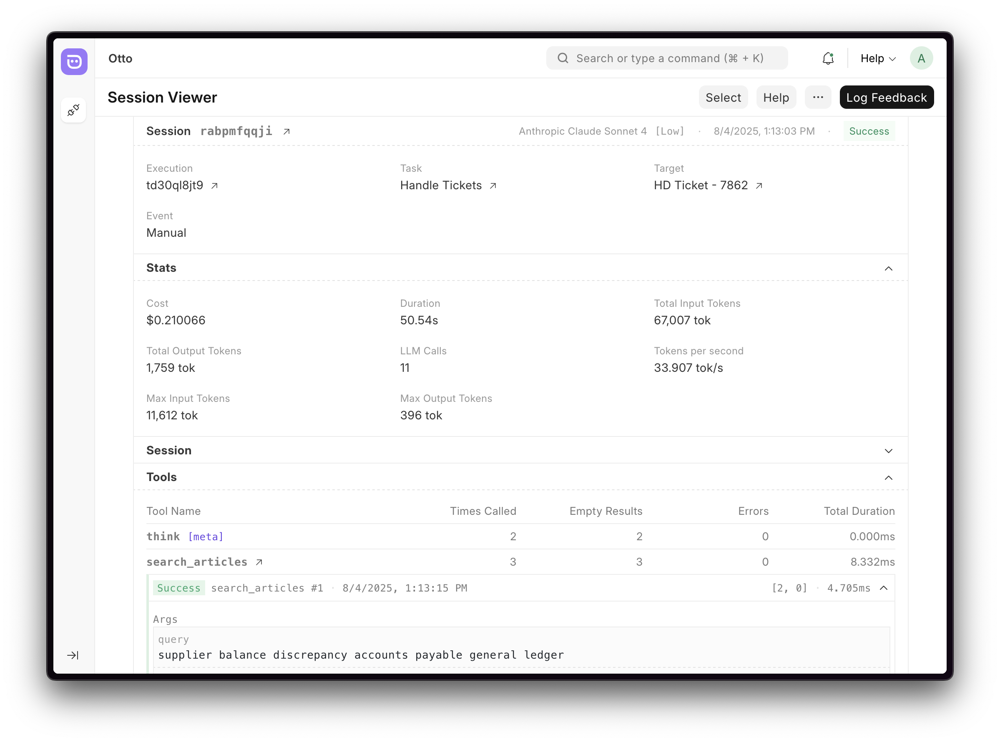

<div align="center" markdown="1">


<h1>Otto</h1>

**Automation intelligence for the Frappe ecosystem**

<div>
    <picture>
        
    </picture>
</div>

</div>

> [!WARNING]
>
> Otto is in very early stages of development, the application aspects of it are
> still under heavy experimentation.
>
> Nevertheless, you may use it as library in your own Frappe app to manage interaction
> with LLMs.
>
> [Library documentation](./otto/lib/docs/README.md) for reference.

### Overview

Otto is a [Frappe Framework](https://github.com/frappe/frappe) app which will be
used for adding intelligent automation capabilities to Frappe apps.
We're developing it to be a framework for:

1. Automating task handling using.
2. Building custom assistants over Frappe apps.

Otto's app features are built on top of it's library. You may use this in your
Frappe app to handle LLM integrations. ([Docs](./otto/lib/docs/README.md))

### Current State

Otto can currently be used for simple task automation.

If you wish to try it out, here are the following doctypes you can check out:

- **Otto Task**: definition of a task that can be automated. Task execution is triggered manually or by doctype lifecycle events.
- **Otto Tool**: definition of a tool that can be used for in a task. Tools run in a server-script like environment.
- **Otto LLM**: available LLMs that can be used for a task. You can check [`otto_llm.json`](https://github.com/frappe/otto/blob/develop/otto/fixtures/otto_llm.json) for available models.
- **Otto Execution**: record of a task execution, backed by the purpose agnostic `Otto Session` doctype.
- **Otto Settings**: configure your API keys to use the available models.

Most doctype fields have help text associated with them, you may refer to them
until proper docs are written.

#### Example internal use case

An internal use case we've applied Otto to is the handling of first response on a
support ticket. We're doing this by using our internal
[Helpdesk](https://github.com/frappe/helpdesk) Knowledge Base and
[docs.frappe.io](https://docs.frappe.io) as data sources.

We find that for simpler support queries its performance is limited by the
quality and availability of references, and for complex and longer queries it's
limited by the model's context coherence. Around 40% of provided feedback is
positive (not all handled tickets receive feedback).

#### Bigger picture

This app is part of a larger project in Frappe that aims to explore the best
ways to apply whatever state of the art artificial intelligence is available.

Another sub-project is [`frappe/mcp`](https://github.com/frappe/mcp).

All of these are still in very early stages of development.

### Library Examples

Brief example of how the library can be used. Link to [full library docs](./otto/lib/docs/README.md) for more details.

```python
import otto.lib as otto
from otto.lib.types import ToolUseUpdate


# 1. Fetch model matching some criteria
model = otto.get_model(supports_vision=True, size="Small", provider="OpenAI") # str model id


# 2. Create new session
session = otto.new(
    model=model,
    instruction="You are a helpful coding assistant",
    tools=[calculator_tool_schema],
)

# Save id to resume session later
session_id = session.id


# 3. Interact (streaming)
stream = session.interact("Calculate 15 * 23", stream=True)
for chunk in stream:
    print(chunk.get("text", ""), end="")
result = stream.item


# 4. Handle tool use
for tool in session.get_pending_tool_use():
    result = execute_tool(tool.name, tool.args) # execute tool

    # update session with tool result
    session.update_tool_use(
        ToolUseUpdate(id=tool.id, status="success", result=result)
    )

# Continue session with tool result
session.interact(stream=False)


# 5. Load and resume interaction (non-streaming)
session = otto.load(session_id)
response, _ = session.interact("What was the result?", stream=False)
if response:
    print(response["content"])
```

### Local Installation and Usage

You can install this app using the [bench](https://github.com/frappe/bench) CLI, first setup a Frappe bench directory and create a new site then:

```bash
# In you bench directory
bench get-app otto --branch develop
bench --site site-name install-app otto
```

#### Usage

It is not recommended to use Otto, but should you be curious enough here are
some steps you can try out.

1. Set API keys in the **Otto Settings** doctype.
2. Navigate to **Otto LLM** select an available model for the key you've provided.
3. Click on the **Ask** action under **Otto LLM** to test that the LLM is being called.
4. Navigate to **Otto Session** to view the previous interaction.
5. Navigate to **Otto Task** and create a new task:
   - Select a DocType and an event you want to trigger on, for testing you can select **ToDo** and **Manual**.
   - Fill out _Instruction_ for what you want your task to do.
   - Fill out _Get Context_ with transformation of the Doc into context info selected.
   - Add tools if require (when creating a new tool, you can check the _Mock Tool_ option)
6. Click on the _Execute Task_ button to test out the task you've created.
7. Click on the _Otto Execution_ link in the dialog and click on Open in Session Viewer (in the right panel)
8. Complete output will only be visible after the task has completed executing.

## Links

- [Otto Lib Docs](./otto/lib/docs/README.md)

<br>
<br>
<div align="center">
	<a href="https://frappe.io" target="_blank">
		<picture>
			<source media="(prefers-color-scheme: dark)" srcset="https://frappe.io/files/Frappe-white.png">
			
		</picture>
	</a>
</div>
